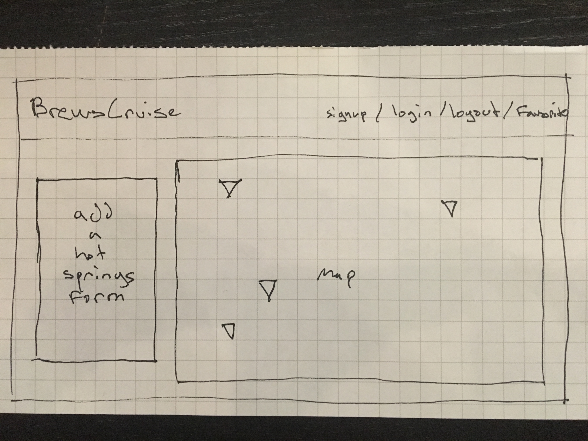
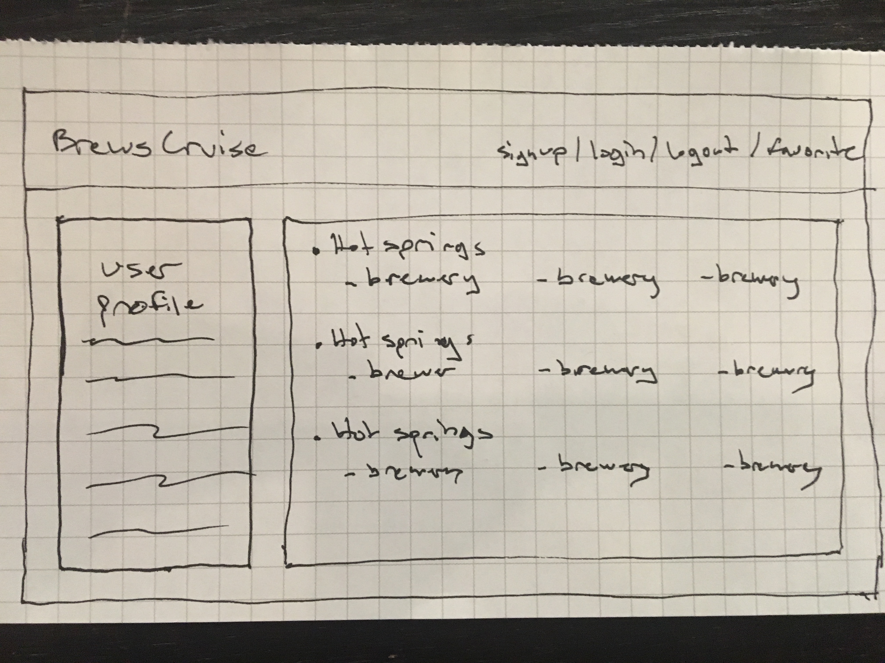

BrewsCruise will be an Angular app. Users will be able to see a list of hot springs across Colorado, click on an instance and see nearby breweries.. for obvious important reasons.

In addition, users can add instances to the list that aren't already included.

This app will be built on Angular.

This app currently uses in memory web api and in memory data service to mock api and database functionality.

Future iterations will integrate Firebase for the database and consume a hot springs api that I'm in the process of building with plans to host in the long run.

Wireframes

Trello
https://trello.com/b/4BLR5Z39/brewscruise

Demo Online
http://lonely-blood.surge.sh